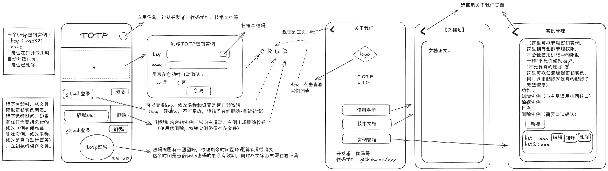

# totp

一个符合RFC 6238标准的TOTP密码计算应用（可以用于github 2fa登录验证）

## 设计图

## 目录

- android：android配置
- assets：资源文件
- demo：功能demo
- doc
- lib：
  - components：直接复制代码来用的组件，考虑吃透之后改写到widgets目录
  - dart
  - model：数据结构
  - widgets：组件
  - `*.dart`文件：主要页面

## 使用

todo

`flutter build apk --split-per-abi`
`flutter install --use-application-binary=build/app/outputs/flutter-apk/app-arm64-v8a-release.apk`

查看手机cpu架构：（需要手机开启usb调试）
`adb shell getprop | grep cpu`

## 技术

todo
