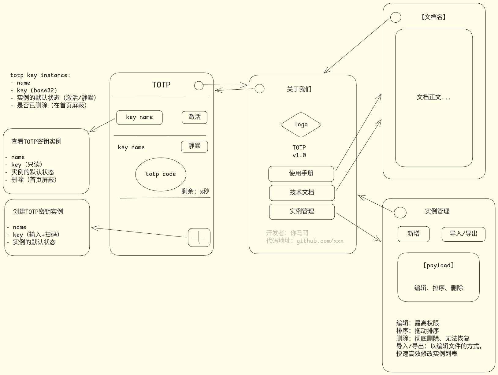

# totp

一个符合RFC 6238标准的计算TOTP Code的android应用（可以用于github 2fa登录验证）

## 设计图



设计说明：

1. 程序在中途某个版本引入加密存储，即本地文件在保存之前会进行加密。这是一次破坏性更新，不考虑兼容那之前的版本。
2. 该工具为小规模实例设计，预期规模在个位数这一数量级，不考虑超过50、100个的实例规模，所以一些内容是可以接受的：
    - 只是使用列表平铺展示，如果实例数量很多，没有明确的定位标识
    - 批量初始化实例时，一个实例出错就退出：该工具的使用者很可能只有一个实例
    - 加解密不规范，加密文件开头没有算法参数：不加了，简单一点
3. 初始化阻塞时允许白屏

## 版本

```txt
Flutter 3.47.2 • channel stable • https://github.com/flutter/flutter.git
Framework • revision d3b14c8769 (11 天前) • 2026-08-26 16:07:51 -0700
Engine • hash 1cf1c4773fb941c4c74a7f8bb144a8837596c0f4 (revision a804b26164) (12
days ago) • 2026-08-26 18:46:13.000Z
Tools • Dart 3.13.2 • DevTools 2.60.0
```

项目启动依赖很多环境，例如：`flutter`/`java`/`gradle`/`AGP`/`AGP plugin`/`kotlin`，它们当中只要有一个不兼容，
程序就无法运行。所以不建议单独升级某一个环境，而是交给flutter统一管理，想要升级也是升级flutter、创建新项目然后合并。

## 常用命令

设置国内镜像：`android/gradle/wrapper/gradle-wrapper.properties`文件，
`distributionUrl`的值修改为：`https\://mirrors.cloud.tencent.com/gradle/gradle-9.3.1-all.zip`

- `flutter create --platforms=android`
- `flutter clean`
- `flutter pub get` 下载依赖
- `flutter run -v`
- `flutter test`
- `flutter build apk --split-per-abi` 打包
- `flutter install --use-application-binary=build/app/outputs/flutter-apk/app-arm64-v8a-release.apk`
    - 这里要具体指到对应架构的包，不然flutter会安装成示例代码；或者打包时不区分架构也行

ADB:

- `adb shell getprop | grep cpu` 查看手机cpu架构（需要手机开启usb调试）
- `adb shell ls -l /sdcard/Download/` 列举模拟器指定目录的文件
- `adb push ./message.txt /sdcard/Download/` 向模拟器发送文件
- `adb pull /sdcard/Download/ .` 从模拟器下载文件
